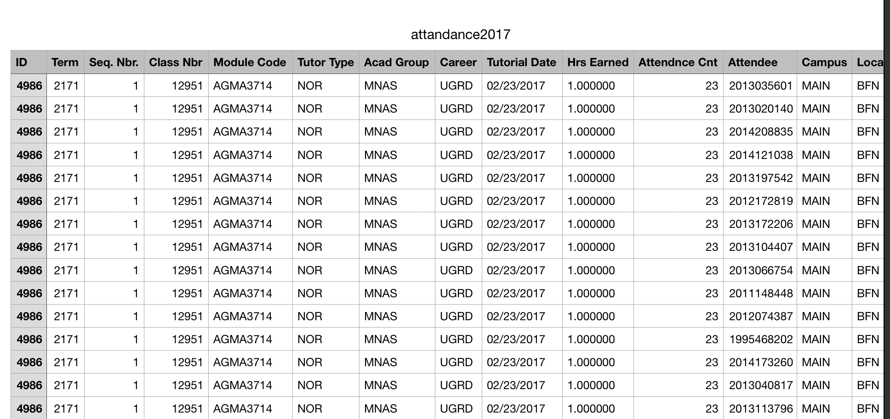

CLT ASIS knitr\_report
================
Gaonyalelwe Maribe

# System doc

The ASIS reporting application is written using the [**R
Shiny**](https://shiny.rstudio.com/) web development framework. The
project includes 9 [**R**](https://www.r-project.org/) header scripts
and one [**rmarkdown**](https://rmarkdown.rstudio.com/) written using
knitr.

This is a private repository containing the ASIS project CTL project for
generating impact reports using student attendance and performance data.
This repository is maintained by [**xdelta
analytics**](https://www.xdelta.co.za).

## Software Requirements

You will need to install the following software on your system to edit
or configure the r scripts, markdown files, the yaml files, dockerfile
and header files. For testing and deployment. For the docker image,
these requirements are already listed in the dockerfile.

  - ubuntu 18.04 os
      - docker.io, pandoc, gdebi-core, pandoc, pandoc-citeproc,
        libcurl4-gnutls-dev, libcairo2-dev/unstable, libxt-dev,
        libssl-dev, libxml2-dev
  - r-base:3.5.0
  - r-studio: latest
  - r libraries to install
      - ‘knitr’,‘shiny’, ‘shinydashboard’,‘ppcor’,
        ‘dplyr’,‘rmarkdown’,‘DT’,‘htmlwidgets’,
        ‘httpuv’,‘shinyalert’,‘Hmisc’,
        ‘plotly’,‘kableExtra’,‘shinyjs’, ‘kableExtra’,
        ‘phantomjs’
  - GitHub and Dockerhub

## Set-Up Configurations

### Environments

  - **Rprofile**: Ensure that shiny is listening on localhost with port
    3838

<!-- end list -->

``` r
local({
   options(shiny.port = 3838, shiny.host = "0.0.0.0")
})
```

  - **knitr**

<!-- end list -->

``` r
knit_hook$set(set_envir = function(before, options, envir){
  if(before)
    set.environment(options$set_envir)
  else
    set.envir(globalenv())
})

options(tinytex.verbose = TRUE)
knitr::opts_chunk$set(echo = TRUE)
knitr::opts_chunk$set(echo = TRUE, fig.align="center")
knitr::opts_chunk$set(echo = TRUE, warning=FALSE)
```

### Accounts to setup:

  - GitHub `[xdelta will provide access to the ASIS repo]`
  - Dockerhub `[xdelta will provide access to the ASIS repo]`
  - UFS access to the asis\_server `[Developers on the project will have
    to apply to ICT for access]`

## Set-up the container manager

The system uses the [**shinyproxy**](https://www.shinyproxy.io/) to
manage containers. The configuration file for shinyProxy can be found on
the server `$HOME` directory in `~/shinyproxy/target/application.yml`.
Documentation for this is available on the
[**shinyproxy**](https://www.shinyproxy.io/) page.

The production docker image can be built on prem. (documentation on this
can be found on the [**docker**](https://docs.docker.com/) website). The
image can then be pushed to [**dockerhub**](https://hub.docker.com/):

An account will first need to be created. Then login from your `command
line interface` (CLI):

`docker login --username=yourhubusername --email=youremail@company.com`

Check if the docker image exists:

`docker images`

Tag the image:

`docker tag b************ yourhubusername/knitr_report:asisV`

And you should be ready to push:

`docker push yourhubusername/knitr_report:asisV`

### Data uploading script

**data\_collection1.R** contains the `data_collection_ui1` function
which is called by the `server` script to paste the `ui` of the first
page for the user to upload the *attendance* data file. This function is
only called if the *complete\_data.RData* R object is not found in the
project directory. The server variable `e` is then set globally to zero,
indicating that the current `ui` being used is `data_collection_ui1`.

**data\_collection2.R** contains the `data_collection_ui2` function
which is called by the `server` script to paste the `ui` of the second
page for the user to upload the *performance* data file. The `server`
variable `e` is then set globally to 1, indicating that the current `ui`
being used is `data_collection_ui2`.

### Data aggregation script

The data aggregation script `data_compile.R` uses the two uploaded
‘**delimiter corrected**’ data sets *attendance* and *performance*.
These two files are stored on the `$HOME` directory. The data is then
aggregated into a dataframe called `GroupedData` and stored in a file
called *“complete\_data.RData”*. This file is attached to every docker
instance volume and should be purged everytime your docker instance is
stopped.

### Reporting

The `server.R` file is well commented, it uses the reporting headers
from the `Decision_Function.R` script which imports the `GroupedData`
and runs decisions on the subset modules (parameters from the
`reporting_ui`). The `server.R` file then writes all the report text
into a file called `our_info` and prints all report images into the
`$images` directory attached to the docker volume.

# User doc

## Data import

When prompted, the user should upload the attendance data from the `CTL
attendance dashboard`. This data should look like the attached figure:


Once this data is uploaded, the user has to chose a delimiter that
separates the columns of the data correctly into a table. You will be
given some instructions at the bottom of the page, these instructions
will guide you when requesting for data from DIRAP to ensure you have
the correct performance data.

Once you’re satisfied proceed to pressing the **next** button on the
bottom left of the sidebar. The user will then be prompted to upload the
performance data. Follow again the same process in separating the
columns correctly into a table and press done. The files will be proced
by the `data_compile.R` script and the resulting `GroupedData` stored
into an `RData` object.

By now your user interface will be showing a slidebar with some
parameters that you can change as you please and a main panel showing
some prelim results on a modular level. After selecting your parameters,
generate your report and download a word version to edit as you please.
